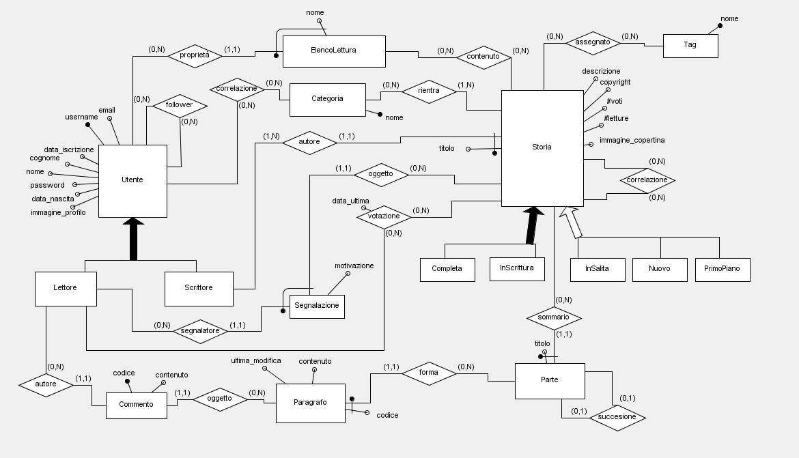
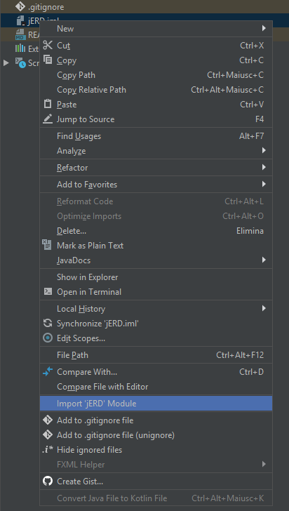

# jERD - Java Entity-Relationship Diagrams Tool

A java application to build Entity-Relationiship schema using a generic University notation.

## Getting Started

Clone the project and run it with [Intellij Idea](https://www.jetbrains.com/idea/) or download last release [here](https://github.com/gaborando/jERD/releases).

### Prerequisites

This project GUI is developed with [Intellij Idea GUI Designer](https://www.jetbrains.com/help/idea/components-of-the-gui-designer.html), so if you want to download and use 
this project install [Intellij Idea](https://www.jetbrains.com/idea/).

### Installing & Deployment

1.	Open the project in [Intellij Idea](https://www.jetbrains.com/idea/).
2. 	Import the module jERD.iml. 
 
3. 	(Build & Run) || Build JAR

## Built With

* [jGraphX](https://github.com/jgraph/jgraphx) - The framework used to build graphs
* [Intellij GUI Designer](https://www.jetbrains.com/help/idea/gui-designer-basics.html) - Component used to build GUI
* [Gson](https://github.com/google/gson) - Used for serialization

## Contributing

Please read [CONTRIBUTING.md](doc/CONTRIBUTING.md) for details on code of conduct, and the process for submitting pull requests.

## Authors

* **Gabor Galazzo** - *Software Developer* - [LinkedIn](https://www.linkedin.com/in/gabor-galazzo/)

See also the list of [contributors](https://github.com/your/project/contributors) who participated in this project.

## License

This project is licensed under the MIT License - see the [LICENSE.md](LICENSE.md) file for details

## Acknowledgments

* This Project was born to help University Students/Professors to learn/teach Databases and IS.

